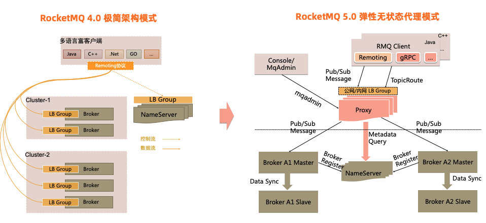

## Apache RocketMQ 5.0
Apache RocketMQ 是一款面向万亿级消息规模的 AI 原生异步通信引擎。诞生于阿里巴巴高并发电商场景，经过数千家企业的生产验证，
RocketMQ 已从高性能消息队列演进为统一消息平台，横跨传统业务消息、事件流处理和新兴的 AI 原生通信三大范式。

RocketMQ 5.0 严格定义了消息类型，即Normal、FIFO、Delay、Transaction，在Broker开启`enableTopicMessageTypeCheck=true`的情况下，生产或消费的消息类型必须与
Topic指定的消息类型一致，否则Broker会拒绝请求并返回“类型不匹配”错误。

### Quick Start
#### Run RocketMQ locally
download [rocketmq-all-5.5.0-bin-release.zip](https://dist.apache.org/repos/dist/release/rocketmq/5.5.0/rocketmq-all-5.5.0-bin-release.zip)
```
> nohup sh bin/mqnamesrv &
> tail -f ~/logs/rocketmqlogs/namesrv.log
> nohup sh bin/mqbroker -n localhost:9876 --enable-proxy &
> tail -f ~/logs/rocketmqlogs/proxy.log
> sh bin/mqshutdown broker
> sh bin/mqshutdown namesrv
```

#### Create Topic and Consumer Group
RocketMQ 5.0 要求必须手动创建Topic和消费组，可使用 mqadmin 工具创建Topic和消费组，也可通过控制台创建Topic和消费组。<br>
```text
git clone https://github.com/apache/rocketmq-dashboard
cd rocketmq-dashboard
mvn spring-boot:run
# 访问http://localhost:8082
# 在控制台创建Topic和消费组
```

本模块boot示例需要创建的Topic和消费组如下

| Topic | 消息类型 | Consumer Group                     |
| --- |------|-------------------------------|
| demo-normal-topic | 普通消息 | my-consumer_demo-normal-topic |
| demo-fifo-topic | 顺序消息 | my-consumer_demo-fifo-topic   |
| demo-delay-topic | 延迟消息 | my-consumer_demo-delay-topic  |
| demo-trans-topic | 事务消息 | my-consumer_demo-trans-topic  |

#### Run Consumer and Producer
```shell
mvn spring-boot:run -Pconsumer
```
```shell
mvn spring-boot:run -Pproducer
```

### 架构

RocketMQ 5.0 引入了全新的弹性无状态代理模式，将当前的Broker职责进行拆分，对于客户端协议适配、权限管理、消费管理等计算逻辑进行抽离，
独立无状态的代理角色提供服务，Broker则继续专注于存储能力的持续优化。这套模式可以更好地实现在云环境的资源弹性调度。 值得注意的是
RocketMQ 5.0的全新模式是和4.0的极简架构模式相容相通的，5.0的代理架构完全可以以Local模式运行，实现与4.0架构完全一致的效果。
开发者可以根据自身的业务场景自由选择架构部署。

### 轻量API和多语言SDK
除了架构改变，RocketMQ 5.0 重新思考了面向开发者的集成界面，即API和SDK的设计。RocketMQ 4.x SDK 是比较重量级的富客户端模式，
提供了诸如顺序消费、广播消费、消费者负载均衡、消息缓存、消息重试、位点管理、推拉结合、流控、诊断、故障转移、异常节点隔离等一系列能力。
这些复杂能力虽然可以帮助业务集成解决实际问题，但其自身的演进和迭代却存在比较大的负担，客户端的升级和多语言普及难度较大。
从API的简洁性和友好性方面，RocketMQ 5.0正在做轻量化设计。

RocketMQ 5.0 推出了基于 gRPC 全新的多语言 SDK，这套 SDK 有几个重要特点： 采用全新极简的 API，拥有不可变 API 的设计，
完善的错误处理，各语言 SDK API 在本地语言层面对齐，新的API 化繁为简，更易被使用和集成。 采用云原生的 RPC 标准框架 gRPC，
标准的传输层框架，更易被拦截，特别适合被 Service Mesh 集成从而赋予其更多的传输层基础能力。 客户端轻量化，以典型的
「SimpleConsumer」为代表，采用全新的面向消息的无状态消费模型，整个 SDK 从代码到运行时都极为轻量。轻量化是一种非常重要能力，
如果各个中间件都采取富客户端的形式，这些中间件当被一起植入到 Sidecar 中时，也会是一个非常庞大的 Sidecar，应用框架集成的复杂度非常高。

除了API/SDK的设计优化，RocketMQ 5.0 还引入了一种无状态消费模型，即 Pop 机制，创新性地在队列模型之上支持了无状态的消息模型，
在一个主体上同时支持两种消费模型，体现了消息和流的「二象性」。面向流场景采用高性能的队列模型进行消费；面向消息的场景，采用无状态
的消息模型进行消费。业务可以只关心消息本身，通过「SimpleConsumer」提供单条消息级别的消费、重试、修改不可见时间、以及删除等API 能力。
