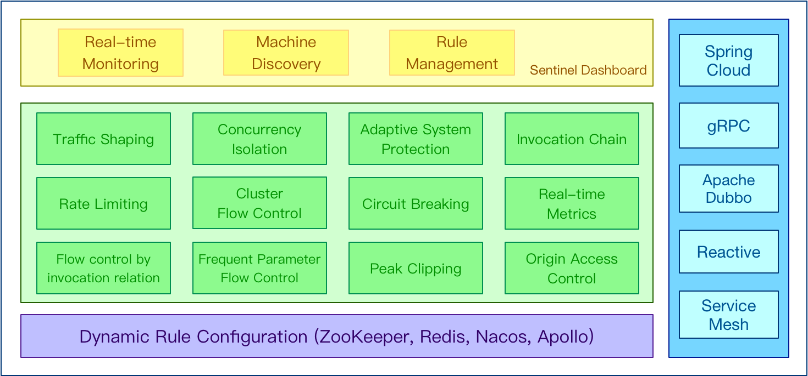

## sentinel
面向分布式、多语言异构化服务架构的流量治理组件



### dashboard
1. 下载 dashboard `https://github.com/alibaba/Sentinel/releases`
2. java -jar sentinel-dashboard-1.8.10.jar
3. 应用引入如下依赖与 dashboard 通信
```xml
<dependency>
    <groupId>com.alibaba.csp</groupId>
    <artifactId>sentinel-transport-simple-http</artifactId>
    <version>1.8.10</version>
</dependency>
```
4. 应用启动时添加参数`-Dcsp.sentinel.dashboard.server=localhost:8080`

完成以上步骤后即可在 Sentinel 控制台上看到对应的应用，机器列表页面可以看到对应的机器